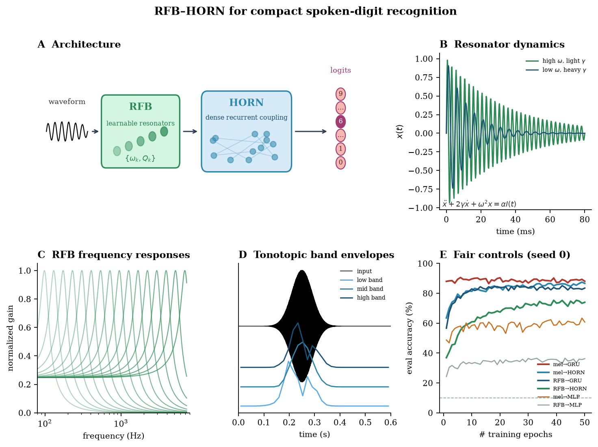

# RFB–HORN: compact spoken-digit recognition

**Read the paper:** [**rfb_horn.pdf**](rfb_horn.pdf) (8 pages)

[](rfb_horn.pdf)

**Author:** Samim A. Winiger (AI agents disclosed in acknowledgments only).

**Claim (post fair controls):** temporal integration is load-bearing; HORN is a compact sequential head (~7k ≈ mel→GRU at ~19k); RFB helps white-noise robustness; mel ≥ RFB on clean digits with fair heads.

Narrative markdown mirror: [`../paper_oscnet_rfb_horn.md`](../paper_oscnet_rfb_horn.md).

---

## Sources (how this is built)

| File | Role |
| --- | --- |
| [`rfb_horn.pdf`](rfb_horn.pdf) | Compiled paper |
| [`rfb_horn.tex`](rfb_horn.tex) | LaTeX source |
| [`references.bib`](references.bib) | Bibliography |
| [`figures/`](figures/) | Generated figures (PDF + PNG) |

### Build PDF

```bash
cd docs/papers/paper_rfb_horn
pdflatex rfb_horn.tex && bibtex rfb_horn && pdflatex rfb_horn.tex && pdflatex rfb_horn.tex
```

### Regenerate figures

From the repo root (requires Modal CSV summaries under `outputs/analysis/`):

```bash
python docs/papers/paper_rfb_horn/make_figures.py
python docs/papers/paper_rfb_horn/make_hero_figure.py
```

### Key Modal presets

```bash
modal run scripts/modal_audio_digit.py --sweep-preset rfb_plus_controls
modal run scripts/modal_audio_digit.py --sweep-preset rfb_plus_isoparam
```
